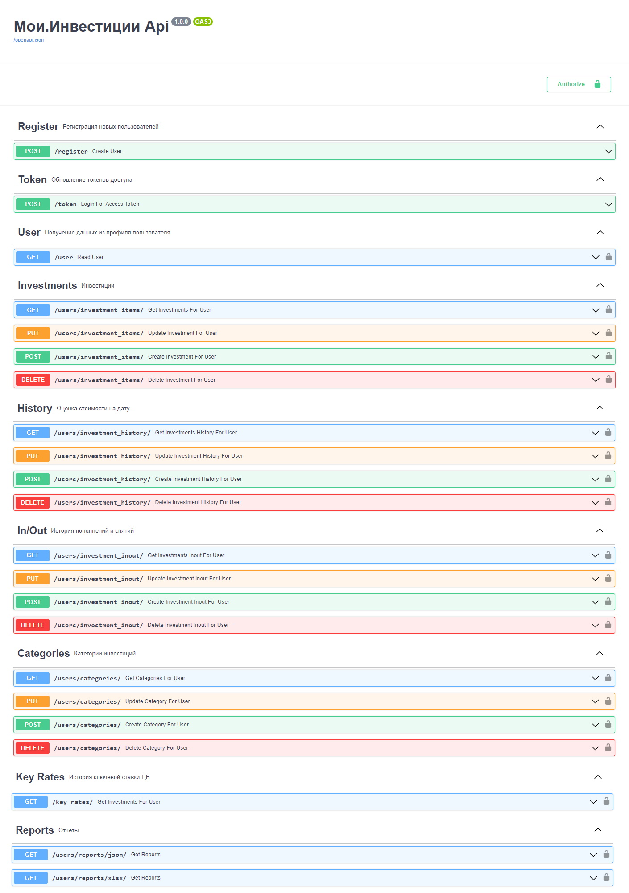

# Мои.Инвестиции

Backend сервиса "Мои.Инвестиции". Используется FastApi/PostgreSQL.

Реализованы:
- регистрация и авторизация, демо-режим
- ведение инвестиционных инструментов по категориям (категории задаются пользователем, например ценные бумаги, недвижимость, валюты/криптовалюты и т.п.)
- история оценки стоимости на дату (выполняются пользователем с необходимой ему периодичностью)
- история пополнений и снятий (пополнение брокерского счета, арендные платежи от недвижимости, ее ремонт/мелкий ремонт, покупка криптовалюты и т.п.)
- отчеты в json и xlsx в разрезе инвестиционных инструментов (история соотношения оценочной стоимости к затратам с учетом пополнений/снятий, история соотношения к индексу "ЕслиНаВклад", опирающегося на ключевую ставку ЦБ и т.д.)

Frontend здесь <comming soon>

